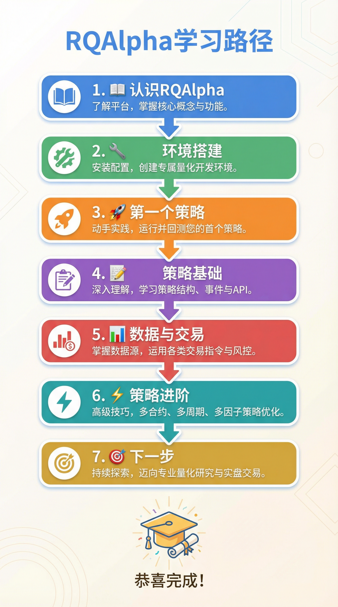

# 📚 RQAlpha 新手入门教程

> 从零开始，7 课带你掌握量化交易回测框架

---

## 👋 欢迎来到 RQAlpha！

如果你是第一次接触量化交易，或者第一次使用 RQAlpha，那么你来对地方了！

这套教程专为**完全新手**设计，我们会用最通俗易懂的语言，一步步带你：

- ✅ 理解什么是量化交易
- ✅ 成功安装并运行 RQAlpha
- ✅ 运行你的第一个策略
- ✅ 学会编写自己的交易策略
- ✅ 掌握数据获取和下单交易
- ✅ 了解进阶技巧和扩展方向

---

## 🗺️ 学习路线图



<details>
<summary>📝 文字版路线图（点击展开）</summary>

```
开始
  │
  ▼
┌─────────────────────────────────────────────────────────┐
│  第1课：认识 RQAlpha                                      │
│  了解量化交易和 RQAlpha 的基本概念                         │
└─────────────────────────────────────────────────────────┘
  │
  ▼
┌─────────────────────────────────────────────────────────┐
│  第2课：环境搭建                                          │
│  安装 Python、RQAlpha，下载数据包                         │
└─────────────────────────────────────────────────────────┘
  │
  ▼
┌─────────────────────────────────────────────────────────┐
│  第3课：运行第一个策略                                     │
│  运行示例策略，理解回测结果                                │
└─────────────────────────────────────────────────────────┘
  │
  ▼
┌─────────────────────────────────────────────────────────┐
│  第4课：策略编写基础                                       │
│  学习策略结构、核心函数、context 对象                      │
└─────────────────────────────────────────────────────────┘
  │
  ▼
┌─────────────────────────────────────────────────────────┐
│  第5课：数据与交易                                         │
│  获取历史数据、下单函数、持仓查询                          │
└─────────────────────────────────────────────────────────┘
  │
  ▼
┌─────────────────────────────────────────────────────────┐
│  第6课：策略进阶                                           │
│  技术指标、多股票策略、定时任务                            │
└─────────────────────────────────────────────────────────┘
  │
  ▼
┌─────────────────────────────────────────────────────────┐
│  第7课：下一步学习                                         │
│  Mod 扩展、进阶路径、社区资源                              │
└─────────────────────────────────────────────────────────┘
  │
  ▼
🎉 恭喜完成！
```

</details>

---

## 📖 课程目录

| 课程 | 主题 | 预计时间 | 难度 |
|:----:|------|:--------:|:----:|
| [第1课](./lesson-01-introduction.md) | 认识 RQAlpha | 20分钟 | ⭐ |
| [第2课](./lesson-02-installation.md) | 环境搭建 | 30分钟 | ⭐ |
| [第3课](./lesson-03-first-strategy.md) | 运行第一个策略 | 30分钟 | ⭐ |
| [第4课](./lesson-04-strategy-basics.md) | 策略编写基础 | 45分钟 | ⭐⭐ |
| [第5课](./lesson-05-data-and-trading.md) | 数据与交易 | 45分钟 | ⭐⭐ |
| [第6课](./lesson-06-advanced.md) | 策略进阶 | 60分钟 | ⭐⭐⭐ |
| [第7课](./lesson-07-next-steps.md) | 下一步学习 | 20分钟 | ⭐ |

**总计学习时间**：约 4-5 小时

---

## 🎯 学习目标

完成本教程后，你将能够：

1. **理解** 量化交易的基本概念
2. **独立** 安装和配置 RQAlpha 环境
3. **运行** 策略回测并解读结果
4. **编写** 简单的交易策略
5. **使用** 常用的数据和交易 API
6. **知道** 如何进一步学习和扩展

---

## 📋 前置要求

开始学习前，请确保你具备：

| 要求 | 说明 |
|------|------|
| 💻 电脑 | Windows、Mac 或 Linux 均可 |
| 🌐 网络 | 需要下载软件和数据 |
| 📝 基础编程概念 | 了解变量、函数等基本概念（不需要精通） |
| ⏰ 时间 | 每课 20-60 分钟 |

> 💡 **小贴士**：即使你完全没有编程经验，也可以尝试跟着教程走。遇到不懂的代码，先照着做，慢慢就会理解的！

---

## 🚀 开始学习

准备好了吗？让我们从第一课开始！

👉 [**第1课：认识 RQAlpha**](./lesson-01-introduction.md)

---

## ❓ 遇到问题？

如果在学习过程中遇到任何问题：

1. **查看常见问题**：每课末尾都有常见问题解答
2. **搜索文档**：访问 [RQAlpha 官方文档](https://rqalpha.readthedocs.io/)
3. **社区求助**：加入 [Ricequant 社区](https://www.ricequant.com/community) 提问
4. **QQ 群**：RQAlpha 交流群 `487188429`
5. **GitHub Issue**：在 [GitHub](https://github.com/ricequant/rqalpha/issues) 提交问题

---

## 📝 学习建议

1. **动手实践**：每课都有实践任务，一定要亲自动手做
2. **循序渐进**：按顺序学习，不要跳过前面的课程
3. **做好笔记**：记录你遇到的问题和解决方法
4. **多尝试**：修改代码看看会发生什么
5. **不要怕错**：回测环境里犯错不会有任何损失

---

## 🙏 致谢

感谢你选择 RQAlpha！

如果这套教程对你有帮助，欢迎：
- ⭐ 给项目点个 Star
- 📢 分享给需要的朋友
- 🐛 提交问题和建议

让我们一起开始量化交易之旅吧！ 🚀

---

*最后更新：2026年1月*
